# Content Audit & Strategic Rehabilitation Plan — Rainwater Directory

**Audit Date**: September 13, 2026  
**Auditor**: Hermes Autonomous Operator  
**Scope**: All 12 published articles in `src/content/blog/`  
**Primary KPI**: Sustainable organic search traffic & directory installer conversions  

---

## Executive Summary

The Rainwater Directory blog consists of 12 published articles totaling ~3,800 words (an average of only ~315 words per article). While the topical breadth across rainwater catchment is sensible, the current library suffers from four critical systemic deficiencies:

1. **Extreme Brevity & Stub Content**: Several articles are thin stubs. Most notably, `how-to-choose-an-installer.md` (698 bytes, ~70 words) and `rainwater-harvesting-legal-status.md` (737 bytes, ~85 words) are 9-line stubs that fail search intent and risk Google "thin content" algorithmic penalties.
2. **Formatting Deficits**: Multiple articles completely lack standard Markdown headings (`##`, `###`), rendering them as giant walls of plain text or simple bulleted outlines.
3. **Broken & Incomplete Internal Linking**: Many articles write raw URL strings in plain text (e.g., `/blog/can-you-drink-rainwater-cdc-science` or `/states`) rather than proper markdown links `[Anchor Text](/path)`. Crucially, almost none link into the core directory assets: the 31 state hubs (`/states/[state]`) or 115+ city installer directories (`/installers/[state]/[city]`).
4. **Keyword Cannibalization & Outdated Titles**: Two articles (`rainwater-harvesting-legal-status.md` and `is-it-illegal-to-collect-rainwater-state-by-state-2025.md`) target identical search queries. Furthermore, the state guide title hardcodes `(2025)`, creating an immediate freshness penalty in 2026.

---

## 1. Comprehensive 12-Article Audit Matrix

Below is the detailed evaluation of each article across all 16 criteria:

| # | Slug | Primary Target Query | Search Intent | Factual Depth | Quality of Sources | Markdown Structure | Directory Links | Cannibalization Risk | Tier | Cluster |
|---|------|----------------------|---------------|---------------|--------------------|--------------------|-----------------|----------------------|------|---------|
| 1 | `how-to-choose-an-installer.md` | "how to choose rainwater harvesting installer", "rainwater collection contractors" | Commercial / Hiring | Critical Stub (~70 words) | None | Broken (1 paragraph, no H2/H3) | 0 links (unlinked text) | None (Unique commercial) | **Tier C** | Buying & Installation |
| 2 | `rainwater-harvesting-legal-status.md` | "is rainwater harvesting legal in the us" | Informational / Legal | Critical Stub (~85 words) | None | Broken (1 paragraph, no H2/H3) | 0 links | **High** (Duplicates slug #3) | **Tier D** | Legal & Regulatory |
| 3 | `is-it-illegal-to-collect-rainwater-state-by-state-2025.md` | "is it illegal to collect rainwater", "rainwater harvesting laws by state" | Informational / Statutory | Moderate (~560 words), lacks statutory table | Mentions states; no statute citations | Broken headings, SVG map included | Raw text paths only | **High** (Cannibalizes slug #2) | **Tier C** | Legal & Regulatory |
| 4 | `can-you-drink-rainwater-cdc-science.md` | "can you drink rainwater", "cdc rainwater drinking safety" | Informational / Safety | Moderate (~450 words) | Mentions CDC/EPA; no citations | Plain text headings, raw URLs | Raw text paths only | Low | **Tier B** | Water Quality |
| 5 | `complete-rainwater-collection-system-guide.md` | "rainwater collection system for homes", "how rainwater harvesting works" | Informational Pillar | Shallow (~450 words) | None | Plain text headings, raw URLs | Raw text paths only | Low | **Tier B** | System Design |
| 6 | `top-10-water-storage-tanks-100-to-5000-gallons.md` | "water storage tanks for homes", "best rainwater collection tanks" | Commercial Investigation | Moderate (~460 words), lacks spec tables | None | Plain text headings, raw URLs | Raw text paths only | Low | **Tier B** | System Design |
| 7 | `cistern-systems-101-underground-water-tanks.md` | "underground rainwater cistern", "cistern systems cost" | Commercial Investigation | Moderate (~380 words), lacks civil engineering details | None | Plain text headings, raw URLs | Raw text paths only | Low | **Tier B** | System Design |
| 8 | `ultimate-guide-whole-house-water-filtration.md` | "whole house rainwater filtration", "sediment carbon uv rainwater" | Technical / Commercial | Moderate (~350 words), lacks micron/GPM tables | None | Plain text headings, raw URLs | Raw text paths only | Low | **Tier B** | Water Quality |
| 9 | `diy-rain-barrel-systems-garden.md` | "diy rain barrel system", "how to build a rain barrel" | DIY / Informational | Moderate (~380 words), good basic steps | None | Plain text headings, raw URLs | Raw text paths only | Low | **Tier B** | DIY & Homeowner |
| 10 | `rainwater-vs-tap-water.md` | "rainwater vs tap water for plants", "is rainwater better than tap" | Informational Comparison | Moderate (~360 words), lacks chemistry table | None | Plain text headings, raw URLs | Raw text paths only | Low | **Tier B** | Water Quality |
| 11 | `choose-right-downspout-diverter-rain-barrels.md` | "how to choose downspout diverter", "rain barrel diverter types" | Commercial / DIY | Shallow (~280 words), lacks gutter sizing math | None | Plain text headings, raw URLs | Raw text paths only | Moderate (overlaps DIY barrel) | **Tier C** | System Design |
| 12 | `off-grid-water-storage-ideas.md` | "off grid water storage ideas", "homestead rainwater collection" | Informational / Homesteading | Shallow (~300 words), lacks water budget math | None | Plain text headings, raw URLs | Raw text paths only | Moderate (overlaps top 10 tanks) | **Tier B** | DIY & Homeowner |

---

## 2. Granular Article Audits

### Article 1: `how-to-choose-an-installer.md`
- **Current URL**: `/blog/how-to-choose-an-installer`
- **Search Intent**: Commercial investigation / Transactional hiring. Homeowners seeking certified, licensed contractors to design, permit, and install complex or potable rainwater harvesting systems.
- **Likely Target Queries**: `how to choose a rainwater harvesting installer`, `rainwater harvesting contractors`, `rainwater collection system installers near me`, `hire rainwater contractor`, `questions to ask rainwater installer`.
- **Current SERP Competitors**: Innovative Water Solutions, Rain Brothers LLC, WaterCache, HarvestH2O, Angi/HomeAdvisor generic contractor landing pages.
- **Does It Satisfy Intent?**: **No.** At 698 bytes and 9 lines, it is an empty stub that fails to answer what licenses are required, what certifications matter, what to expect in pricing, or what questions to ask.
- **Factual Depth & Information Gain**: Near zero. No mention of ARCSA (American Rainwater Catchment Systems Association) Accredited Professionals (ARCSA AP), ASPE/ARCSA Standard 63-2020, backflow prevention licensing, plumbing code compliance, or contract milestones.
- **Internal Linking**: Mentions "Rainwater Directory" in plain text without a hyperlink. Zero links to `/installers/` or state hubs.
- **Cannibalization Risk**: None. Unique high-value commercial topic.
- **Tier Classification**: **Tier C (Poor quality, requires major rewrite)**.

### Article 2: `rainwater-harvesting-legal-status.md`
- **Current URL**: `/blog/rainwater-harvesting-legal-status`
- **Search Intent**: Informational / Legal compliance.
- **Likely Target Queries**: `is rainwater harvesting legal in the united states`, `is it illegal to collect rainwater in the us`.
- **Does It Satisfy Intent?**: **No.** It is a 9-line stub stating "Collecting rainwater is legal in every U.S. state...".
- **Cannibalization Risk**: **Critical / Direct Duplicate.** Targets the exact same keyword cohort and intent as `is-it-illegal-to-collect-rainwater-state-by-state-2025.md`.
- **Tier Classification**: **Tier D (Redundant/cannibalistic, consolidate into state-by-state guide via 301 redirect)**.

### Article 3: `is-it-illegal-to-collect-rainwater-state-by-state-2025.md`
- **Current URL**: `/blog/is-it-illegal-to-collect-rainwater-state-by-state-2025`
- **Search Intent**: Broad informational & statutory research.
- **Likely Target Queries**: `is it illegal to collect rainwater`, `rainwater harvesting laws by state`, `rainwater collection illegal states`.
- **Current SERP Competitors**: 4GenerationsRoofing, World Population Review, Energy.gov, Treehugger.
- **Does It Satisfy Intent?**: Partially. Answers the overarching question but merely lists a couple of state abbreviations (CA, OR, WA, TX, FL) in bullet points without an authoritative state-by-state legal matrix.
- **Factual Depth & Freshness**: Lacks specific state statutory citations (e.g., Texas HB 3399/Tax Code 151.355, Colorado HB 16-1005, Utah SB 32). Title is outdated (`(2025)`).
- **Internal Linking**: Uses raw text paths `/blog/can-you-drink-rainwater-cdc-science` and `/states` rather than clickable anchor links.
- **Tier Classification**: **Tier C (Requires major rewrite, title update to 2026, 50-state statutory table, and consolidation of slug #2)**.

### Article 4: `can-you-drink-rainwater-cdc-science.md`
- **Current URL**: `/blog/can-you-drink-rainwater-cdc-science`
- **Search Intent**: Health, safety, and potable treatment compliance.
- **Likely Target Queries**: `can you drink rainwater`, `is rainwater safe to drink`, `cdc rainwater drinking science`, `make rainwater potable`.
- **Current SERP Competitors**: CDC.gov, EPA, Healthline, WHO, Water-Right.
- **Does It Satisfy Intent?**: Moderately, but lacks technical depth on microbiological standards.
- **Information Gain Opportunities**: Add NSF/ANSI 53, 55 Class A, and 58 standards, pathogen reduction log tables (4-log virus, 3-log Giardia/Cryptosporidium), and roofing material toxicity comparisons.
- **Structure**: Lacks Markdown `##` headings; raw URLs at bottom.
- **Tier Classification**: **Tier B (Worthwhile topic, needs improvement)**.

### Article 5: `complete-rainwater-collection-system-guide.md`
- **Current URL**: `/blog/complete-rainwater-collection-system-guide`
- **Search Intent**: Foundational system architecture and design.
- **Likely Target Queries**: `rainwater collection system for homes`, `how to set up rainwater harvesting system`, `rainwater harvesting components`.
- **Current SERP Competitors**: Fresh Water Systems, The Spruce, Rain Brothers, HarvestH2O.
- **Does It Satisfy Intent?**: Acts as a brief outline, but cannot credibly claim to be a "Complete Guide" at 450 words.
- **Information Gain Opportunities**: Add system schematics, friction loss rules of thumb, first-flush sizing calculations ($1-2\text{ gal per } 100\text{ sq ft}$), and pump head sizing.
- **Tier Classification**: **Tier B (Worthwhile topic, needs improvement)**.

### Article 6: `top-10-water-storage-tanks-100-to-5000-gallons.md`
- **Current URL**: `/blog/top-10-water-storage-tanks-100-to-5000-gallons`
- **Search Intent**: Equipment selection and commercial comparison.
- **Likely Target Queries**: `best water storage tanks for rainwater`, `rainwater collection tanks 1000 gallon`, `poly vs steel rainwater tanks`.
- **Current SERP Competitors**: Tank Depot, Plastic Mart, Pioneer Water Tanks, Bushman Tanks.
- **Does It Satisfy Intent?**: High-level categorization, but completely lacks material specifications, cost-per-gallon benchmarks, UV-stabilization ratings, and foundation requirements.
- **Tier Classification**: **Tier B (Worthwhile topic, needs improvement)**.

### Article 7: `cistern-systems-101-underground-water-tanks.md`
- **Current URL**: `/blog/cistern-systems-101-underground-water-tanks`
- **Search Intent**: Large-scale underground residential & commercial rainwater storage.
- **Likely Target Queries**: `underground rainwater cistern`, `residential cistern system cost`, `in ground water storage tank`.
- **Current SERP Competitors**: Bob Vila, This Old House, Tank Depot, Graf Water.
- **Does It Satisfy Intent?**: Decent high-level summary, but missing civil engineering realities: soil compaction, water table buoyancy calculations, traffic-rated access risers, and confined-space safety.
- **Tier Classification**: **Tier B (Worthwhile topic, needs improvement)**.

### Article 8: `ultimate-guide-whole-house-water-filtration.md`
- **Current URL**: `/blog/ultimate-guide-whole-house-water-filtration`
- **Search Intent**: Water filtration engineering and equipment staging.
- **Likely Target Queries**: `whole house rainwater filtration system`, `sediment carbon uv rainwater filter`, `how to filter rainwater for home`.
- **Current SERP Competitors**: Fresh Water Systems, SpringWell, iSpring, Aquasana.
- **Does It Satisfy Intent?**: Only 350 words. Outlines the 3 main stages but omits flow rate sizing (GPM), cartridge micron progressions ($50\mu\text{m} \to 20\mu\text{m} \to 5\mu\text{m}$), and UV dose specs ($30\text{--}40\text{ mJ/cm}^2$).
- **Tier Classification**: **Tier B (Worthwhile topic, needs improvement)**.

### Article 9: `diy-rain-barrel-systems-garden.md`
- **Current URL**: `/blog/diy-rain-barrel-systems-garden`
- **Search Intent**: DIY, suburban gardening, entry-level rainwater harvesting.
- **Likely Target Queries**: `diy rain barrel system`, `how to build a rain barrel`, `make your own rain barrel`.
- **Current SERP Competitors**: Family Handyman, Extension services (Rutgers, Clemson, Texas A&M), Instructables.
- **Does It Satisfy Intent?**: Reasonable step-by-step outline, but needs bulkhead fitting drill bit guides, overflow diameter sizing math, and Bti mosquito control details.
- **Tier Classification**: **Tier B (Worthwhile topic, needs improvement)**.

### Article 10: `rainwater-vs-tap-water.md`
- **Current URL**: `/blog/rainwater-vs-tap-water`
- **Search Intent**: Chemical and practical comparison for plants, cleaning, and drinking.
- **Likely Target Queries**: `rainwater vs tap water for plants`, `is rainwater better than tap water`, `rainwater tds vs tap water`.
- **Current SERP Competitors**: Gardening Know How, Hydrobuilder, Water-Right.
- **Does It Satisfy Intent?**: Good conceptual angle, but lacks empirical chemical water quality data (TDS ppm, pH ranges, calcium carbonate hardness, chloramine persistence).
- **Tier Classification**: **Tier B (Worthwhile topic, needs improvement)**.

### Article 11: `choose-right-downspout-diverter-rain-barrels.md`
- **Current URL**: `/blog/choose-right-downspout-diverter-rain-barrels`
- **Search Intent**: Hardware selection for gutter-to-barrel connection.
- **Likely Target Queries**: `how to choose downspout diverter`, `rain barrel downspout diverter types`, `best diverter for rain barrel`.
- **Current SERP Competitors**: EarthMinded, Oatey, Rain Brothers, Clean Rain.
- **Does It Satisfy Intent?**: Very thin (~280 words). Missing GPM capacity formulas, standard gutter dimension comparisons ($2\times3\text{ in}$ vs $3\times4\text{ in}$ vs 5-inch K-style), and winterization bypass mechanics.
- **Tier Classification**: **Tier C (Poor quality, requires major rewrite)**.

### Article 12: `off-grid-water-storage-ideas.md`
- **Current URL**: `/blog/off-grid-water-storage-ideas`
- **Search Intent**: Off-grid living, homesteading, remote cabins, emergency preparedness.
- **Likely Target Queries**: `off grid water storage ideas`, `homestead water storage`, `ibc tote water storage setup`.
- **Current SERP Competitors**: Homesteading Family, Primal Survivor, Mother Earth News.
- **Does It Satisfy Intent?**: Superficial list. Lacks daily per-capita water budgeting ($15\text{--}35\text{ gal/person/day}$ off-grid vs $80\text{--}100\text{ gal}$ grid-tied), food-grade IBC resin identification (UN/DOT stamp checks), and freeze line depth calculations.
- **Tier Classification**: **Tier B (Worthwhile topic, needs improvement)**.

---

## 3. Tier Classification Summary

- **Tier A (Strong content, keep and maintain)**: **0 articles**. Every article in the existing blog currently lacks proper markdown headers, has broken/raw internal URL paths, or lacks empirical depth.
- **Tier B (Worthwhile topic, needs improvement)**: **8 articles** (`can-you-drink-rainwater-cdc-science.md`, `complete-rainwater-collection-system-guide.md`, `top-10-water-storage-tanks-100-to-5000-gallons.md`, `cistern-systems-101-underground-water-tanks.md`, `ultimate-guide-whole-house-water-filtration.md`, `diy-rain-barrel-systems-garden.md`, `rainwater-vs-tap-water.md`, `off-grid-water-storage-ideas.md`).
- **Tier C (Poor quality, requires major rewrite)**: **3 articles** (`how-to-choose-an-installer.md`, `is-it-illegal-to-collect-rainwater-state-by-state-2025.md`, `choose-right-downspout-diverter-rain-barrels.md`).
- **Tier D (Redundant/cannibalistic, consolidate into another page)**: **1 article** (`rainwater-harvesting-legal-status.md` $\to$ consolidate via 301 into state legal guide).
- **Tier E (Useless/damaging, remove or noindex)**: **0 articles**. All topics possess genuine search demand and clear homeowner utility.

---

## 4. Strategic Content Clusters

```mermaid
graph TD
  subgraph Cluster1["1. Buying & Installation (High Commercial Intent)"]
    Installer["how-to-choose-an-installer.md (PILLAR)"]
    Dir1["Link to /installers/ & State Hubs"]
    Installer --> Dir1
  end

  subgraph Cluster2["2. Legal & Regulatory"]
    LegalPillar["is-it-illegal-to-collect-rainwater-state-by-state (PILLAR)"]
    LegalStub["rainwater-harvesting-legal-status.md (301 Redirect)"]
    Dir2["Link to /states/[state] hubs"]
    LegalStub -->|Consolidate| LegalPillar
    LegalPillar --> Dir2
  end

  subgraph Cluster3["3. System Design"]
    SystemGuide["complete-rainwater-collection-system-guide.md (PILLAR)"]
    Cistern["cistern-systems-101-underground-water-tanks.md"]
    Tanks["top-10-water-storage-tanks-100-to-5000-gallons.md"]
    Diverter["choose-right-downspout-diverter-rain-barrels.md"]
    SystemGuide --> Cistern
    SystemGuide --> Tanks
    SystemGuide --> Diverter
  end

  subgraph Cluster4["4. Water Quality & Potability"]
    Drink["can-you-drink-rainwater-cdc-science.md (PILLAR)"]
    Filter["ultimate-guide-whole-house-water-filtration.md"]
    VsTap["rainwater-vs-tap-water.md"]
    Drink --> Filter
    Drink --> VsTap
  end

  subgraph Cluster5["5. DIY & Homeowner"]
    DIYBarrel["diy-rain-barrel-systems-garden.md (PILLAR)"]
    OffGrid["off-grid-water-storage-ideas.md"]
    DIYBarrel --> OffGrid
  end
```

---

## 5. Recommendation: The #1 Immediate Rehabilitation Priority

### Candidate Selected: `how-to-choose-an-installer.md`

#### Rationale Across All 4 Decision Dimensions:
1. **Commercial Relevance to Rainwater Directory**: **Highest Possible (10/10)**. Rainwater Directory is fundamentally an installer directory (`/installers/`). The site's primary conversion event is connecting prospective buyers with verified local contractors. Currently, this article is a 9-line stub with zero clickable links to the directory.
2. **Search Demand & Commercial Intent**: High lifetime customer value ($5,000 to $35,000+ per system installation). Captures high-intent search queries: `how to choose rainwater harvesting installer`, `rainwater harvesting contractors`, `questions to ask rainwater installer`, `rainwater system installation cost`.
3. **Information Gain Potential**: Tremendous. Competitor pages on Angi, HomeAdvisor, and generic blogs offer generic "check reviews and ask for quotes" advice. We can provide deep, proprietary industry standards:
   - Specific industry credentials (ARCSA AP — American Rainwater Catchment Systems Association Accredited Professional, ASPE/ARCSA/ANSI Standard 63-2020, ASSE 5110 Backflow Prevention Assembly Tester).
   - Plumbing license requirements (Master Plumber vs general contractor vs landscaping specialist).
   - 10-point Contractor Vetting Checklist with exact questions and "good vs bad" answer benchmarks.
   - Comprehensive Installed Cost Benchmark Table by system type (pressurized irrigation, underground cistern, whole-house potable).
   - Key contract scope items (permits, structural/foundation stamps, backflow prevention, electrical disconnects, commissioning, warranty).
   - Direct clickable integration to `/installers/`, `/states/`, and top state markets (Texas, California, Washington, Florida, Ohio).
4. **Ease of Execution**: Can be immediately drafted, peer-reviewed against technical codes, tested, and built without third-party dependencies.

---

## 6. Implementation Plan for Article #1 (`how-to-choose-an-installer.md`)

1. **Title & Frontmatter**:
   - Update title to: `"How to Choose a Rainwater Harvesting Installer: Contractor Vetting Checklist & Cost Guide"`
   - Enhance description for high CTR: `"Essential guide to hiring a qualified rainwater harvesting contractor. Key credentials (ARCSA AP, plumbing licenses), 10 interview questions, cost benchmarks, and red flags."`
2. **Structure & Headings**:
   - `H1`: How to Choose a Rainwater Harvesting Installer
   - `H2`: 1. Verify Professional Credentials and Licenses (ARCSA AP, Plumbing, Backflow)
   - `H2`: 2. Match Contractor Specialization to Your System Type
   - `H2`: 3. 10 Essential Questions to Ask Before Hiring (Table of questions, why to ask, good vs. bad answers)
   - `H2`: 4. System Cost Benchmarks & Realistic Bids (Complete cost table by system category)
   - `H2`: 5. Contract Scope & Commissioning Checklist (Permitting, testing, warranty)
   - `H2`: 6. Critical Red Flags to Watch For
   - `H2`: 7. Find Verified Rainwater Installers in Your State (Direct links to state & city hubs)
3. **Internal Links**:
   - `/installers/` (National installer hub)
   - `/states/texas/` & `/installers/texas/austin/` (Texas Hill Country rainwater capital)
   - `/states/california/` & `/installers/california/`
   - `/states/washington/`
   - `/blog/complete-rainwater-collection-system-guide`
   - `/blog/cistern-systems-101-underground-water-tanks`
   - `/blog/can-you-drink-rainwater-cdc-science`
4. **Verification & Testing**:
   - Run `npm test`
   - Run `npm run build` to confirm 170+ pages build cleanly.
   - Document experiment in `agent/EXPERIMENTS.md` as EXP-002.
   - Update `agent/CURRENT_STATE.md` and `agent/CHANGELOG.md`.
